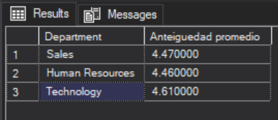

# SQL-SERVER-HR-ANALYTTCS
## Resumen 
Aplicar consultas estructuradas en SQL para extraer, limpiar y analizar los factores críticos que impulsan la rotación de personal (abandono laboral) dentro de la organización.
## Estructura 
- [Sobre los Datos](#sobre-los-datos)
- [Tareas](#tareas)
- [Limpieza de Datos](#limpieza-de-datos)
- [Análisis Exploratorio de Datos e Insights](#análisis-exploratorio-de-datos-e-insights)

## sobre los datos
Los datos originales, junto con una explicación de cada columna, se pueden encontrar [aquí](https://www.kaggle.com/datasets/mahmoudemadabdallah/hr-analytics-employee-attrition-and-performance/data?select=Employee.csv).

## Análisis Exploratorio de Datos e Insights

1. ¿Cuál es la antigüedad promedio de los empleados en cada departamento?

```sql
select Department 
        , round(avg(YearsAtCompany*1.0),2) as [Anteiguedad promedio] 
from Employee
group by Department
```
Encontramos que el departamento de tecnologia tienen un mayor tiempo de permanencia , asumiriamos que es por los ingresos  o tal ves no.



2. ¿Cuántos empleados en cada departamento siguen trabajando en la empresa?

```sql
SELECT Department,
	COUNT(*) AS ActiveEmployees,
    ROUND(COUNT(*) * 100 / (SELECT COUNT(*)
							FROM Employee
							WHERE Attrition = 'No'), 0
                            ) AS PercentageOfActive
FROM Employee
WHERE Attrition = 'No'
GROUP BY Department
ORDER BY ActiveEmployees DESC;
```
- Mi conlusion es 

3.Cual es el promedio  de satisfacción laboral por categoría de antigüedad?

```sql
with employe_antiguedad as (
Select 
		case 
			when YearsAtCompany < 3 THEN '< 3years'
			when YearsAtCompany BETWEEN 3 AND 5 THEN '3-5 years'
			else '>5 years' 
		end grupo_antiguedad
		 ,EmployeeID
		 ,FirstName
		 ,Age
		 ,Department
from Employee
)
select e.grupo_antiguedad,
		avg(r.JobSatisfaction*1.0) promedio_satitfacion
from employe_antiguedad e
join PerformanceRating r on (e.EmployeeID=r.EmployeeID)
group by e.grupo_antiguedad

```

